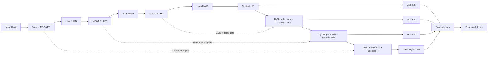

# CrackGH-UNet：裂缝分割项目骨架

这是一个对照 [GH-UNet 官方代码](https://github.com/xiachashuanghua/GH-UNet) 后，针对细长裂缝重新组织的 PyTorch 基线项目。当前版本的目标不是一次堆入所有创新，而是先提供一个可训练、可测试、模块可替换的稳定骨架。具体代码对应关系见 [docs/OFFICIAL_CODE_ALIGNMENT.md](docs/OFFICIAL_CODE_ALIGNMENT.md)。

## 当前版本包含什么

- 三次下采样，最深特征保持在 `H/8 × W/8`，避免过早丢失一到数像素宽的裂缝。
- 与官方 `DoubleConv/D_DoubleConv` 通道流一致的 MSGA：三个分支分别输出完整通道，再经CSG、空洞卷积和残差融合。
- 固定 Haar 小波下采样，显式输出 `LH/HL/HH` 高频分量。
- 编码跳连和解码输出上的分组动态门控GDG。
- 由解码特征和 Haar 高频共同控制的细节门，门值下限默认为 0.2，不能完全关闭跳连。
- 解码采用与官方代码一致的逐元素相加，同时在融合后补充ECA通道注意力。
- 默认使用带作用域分支的DySample，奇数尺寸时自动对齐跳连尺寸。
- `H/8` 卷积上下文占位块，后续在这里换成四分支 Mamba。
- `H/8、H/4、H/2` 三个辅助预测及原尺寸最终预测；最终预测按官方代码进行级联求和。
- 多尺度监督时，辅助预测统一上采样至原始标签尺寸再计算损失。
- BCE + Dice + IoU 复合损失，已提供可开关的 clDice。
- 训练、单图推理、奇数尺寸输入测试和最小反向传播烟雾测试。

## 主体结构



Haar 下采样得到的高频分量分别送给同尺度编码块和对应解码细节门。当前 MSGA 会忽略 `guide` 参数；后续 Wavelet-Scope-AKConv 可以直接使用它，无需改动主网络前向流程。官方代码中的MobileViT并行分支没有直接复制，因为它正是后续要用Mamba替换的部分。

## 项目结构

```text
crack_gh_unet/
├── configs/base_crack.yaml
├── crackseg/
│   ├── data.py
│   ├── losses.py
│   ├── metrics.py
│   └── models/
│       ├── gh_crack_unet.py
│       ├── msga.py
│       ├── sampling.py
│       ├── gates.py
│       ├── context.py
│       └── registry.py
├── docs/MODULE_ROADMAP.md
├── train.py
├── infer.py
├── smoke_test.py
└── tests/test_model.py
```

## 快速开始

建议 Python 3.10+、PyTorch 2.2+。

```bash
python -m pip install -r requirements.txt
python smoke_test.py
pytest -q
```

数据目录默认如下：

```text
data/
├── train/
│   ├── images/xxx.jpg
│   └── masks/xxx.png
└── val/
    ├── images/xxx.jpg
    └── masks/xxx.png
```

图像与掩码默认同名；若掩码为 `xxx_mask.png`，将配置中的 `mask_suffix` 改为 `_mask`。

训练：

```bash
python train.py --config configs/base_crack.yaml --device auto
```

推理：

```bash
python infer.py \
  --config configs/base_crack.yaml \
  --checkpoint runs/base_crack/best.pth \
  --image demo.jpg \
  --output result.png
```

Windows PowerShell 可将反斜杠续行改成一行执行。

## 为什么第一版使用三次下采样

默认通道为 `[32, 64, 96, 160]`，对应 `H、H/2、H/4、H/8`。它比原始面向医学区域分割的深层结构更保守，优先保护细裂缝连续性。若数据中的裂缝较宽、输入分辨率很高且显存允许，可在后续实验中增加 `H/16` 阶段，但不建议直接进入 `H/32`。

## 512×512输入的处理

默认数据配置已经调整为：

```yaml
data:
  image_size: [512, 512]
model:
  input_multiple: 8
  pad_mode: reflect
```

因为 `512` 能被三级下采样因子 `8` 整除，模型不需要额外填充：

```text
输入/标签：512×512
模型内部：512×512
Encoder 1：256×256
Encoder 2：128×128
H/8 Context：64×64
最终输出：512×512
三个辅助输出：全部恢复为512×512
```

这样Haar小波、DySample和后续四扫描Mamba都在规则网格上运行，同时训练标签和推理结果严格保持`512×512`。模型也继续支持其他输入尺寸，并会自动补齐到8的倍数后裁剪回来。

## 损失设置

默认沿用 GH-UNet 消融中较稳定的权重思路：

```yaml
bce_weight: 0.5
dice_weight: 1.5
iou_weight: 0.5
cldice_weight: 0.0
```

裂缝基线稳定后，可以将 `cldice_weight` 从 `0.1` 开始尝试。辅助输出不会下采样标签，而是将预测恢复到`512×512`再监督，以减少细裂缝在监督信号中的消失。

## 当前版本与后续版本的边界

当前已经实现与官方代码主要通道流一致的GH-UNet裂缝基线、DySample、三级级联预测、Haar高频接口和细节门，但还没有加入：

- AKConv/LDConv 的可学习偏移；
- 偏移作用域门、偏移正则和半径热身；
- DAS、SS2D、ES2D、常规扫描的四分支 Mamba；
- AKConv 与 ODConv 对照实现。

这些模块的建议接入位置和接口见 [docs/MODULE_ROADMAP.md](docs/MODULE_ROADMAP.md)。先获得当前基线的 Dice、IoU、Recall、连通性和推理速度，再逐项增加模块，才便于进行可信的消融实验。
